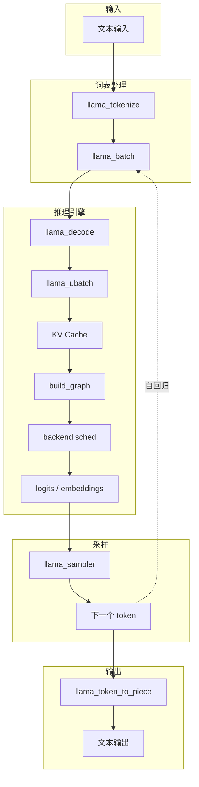

# llama.cpp 软件架构与流程概览

本文档从高层视角梳理 llama.cpp 的模块划分、核心组件职责、模型加载与推理流程，以及工具链组织方式，帮助开发者快速理解代码库结构。

---

## 1. 概述

llama.cpp 是一个以 C/C++ 实现的 LLM 推理引擎，核心目标是：

- 在无外部深度学习框架依赖的情况下运行 Transformer 类大模型。
- 通过 GGUF 格式承载模型权重与元数据。
- 支持 CPU 与多种 GPU / NPU 后端（CUDA、Metal、Vulkan、SYCL、HIP、OpenVINO、WebGPU 等）。
- 提供稳定的 C API，并在此基础上构建 CLI、HTTP Server、多模态、音频生成等应用工具。

整体架构采用清晰的分层设计：

```text
应用层:        app/  tools/  examples/
                 |
公共基础设施:   common/ (参数、采样、聊天模板、日志)
                 |
公共 API:      include/llama.h
                 |
核心推理引擎:   src/ (llama 模型、上下文、KV Cache、采样器)
                 |
张量计算引擎:   ggml/ (张量、计算图、量化、后端抽象)
                 |
硬件后端:       CPU / CUDA / Metal / Vulkan / SYCL / HIP / OpenVINO / WebGPU / ...
```

---

## 2. 顶层目录结构

| 目录 | 职责 |
|------|------|
| `ggml/` | 张量计算与后端抽象库。`ggml/include/` 为公共头文件，`ggml/src/` 为核心实现与各硬件后端实现。 |
| `src/` | llama 核心推理引擎。包含模型加载、上下文管理、计算图构建、词表、采样器、KV Cache 等。 |
| `common/` | 公共基础设施。命令行参数解析、对话模板、日志、采样封装、模型下载等。 |
| `include/` | 公共 C/C++ API。`llama.h` 为主 C API，`llama-cpp.h` 为 C++ 封装。 |
| `tools/` | 面向用户的生产级工具，如 server、cli、quantize、bench 等。 |
| `examples/` | 直接调用 `llama.h` API 的示例程序，覆盖简单生成、批处理、投机解码、嵌入等场景。 |
| `app/` | 统一入口 `llama`，将主要工具以子命令形式打包到一个二进制中。 |
| `tests/` | 单元测试与集成测试，包括 tokenizer、量化、后端算子、状态保存等。 |
| `conversion/` | Hugging Face 模型到 GGUF 的转换脚本，按模型架构分文件组织。 |
| `gguf-py/` | Python 版 GGUF 读写库。 |

---

## 3. 核心组件分层

### 3.1 ggml：张量计算与后端抽象

`ggml` 是底层张量计算库，向上层提供：

- 多维张量 `ggml_tensor` 的定义与生命周期管理。
- 丰富的算子集合（矩阵乘法、归一化、激活、RoPE、注意力等）。
- 计算图 `ggml_cgraph` 的构建与执行。
- 多种量化格式（Q4_0、Q8_0、Q4_K、IQ 系列等）。
- 多后端抽象与调度，使同一张图可在 CPU/GPU 上执行。

关键结构：

- `struct ggml_tensor`：核心张量，包含类型、维度、步长、来源张量、数据缓冲区等。
- `enum ggml_op`：算子枚举，覆盖算术、归一化、激活、位置编码、注意力等。
- `enum ggml_type`：数据类型枚举，包含 F32/F16/BF16 与各类量化类型。
- `struct ggml_cgraph`：计算图，由节点与叶子张量组成。
- `ggml_backend_*`：后端抽象接口，包括设备、缓冲类型、执行流与调度器。

后端抽象关系：

```text
ggml_backend_dev_t (设备)
    -> ggml_backend_buffer_type_t
        -> ggml_backend_buffer_t (承载 tensor->data)

ggml_backend_t (执行流)
    -> 接收 ggml_cgraph 并调用后端 kernel 执行

ggml_backend_sched_t (调度器)
    -> 管理多个 backend，根据张量位置与算子支持度决定执行位置
```

### 3.2 src/：llama 核心推理引擎

在 ggml 之上实现 LLM 推理全生命周期：

| 组件 | 主要文件 | 职责 |
|------|----------|------|
| 模型 | `src/llama-model.cpp` | 加载 GGUF、存储权重、按架构分发。 |
| 上下文 | `src/llama-context.cpp` | 推理运行时、encode/decode、后端调度、输出缓冲。 |
| 计算图 | `src/llama-graph.cpp` | 将 `llama_ubatch` 构建为 `ggml_cgraph`。 |
| 超参数 | `src/llama-hparams.cpp` | 从 GGUF 解析的模型结构参数。 |
| 词表 | `src/llama-vocab.cpp` | Tokenizer、tokenize/detokenize。 |
| 采样器 | `src/llama-sampler.cpp` | 温度、top-k/top-p、mirostat、grammar 等。 |
| 记忆/KV | `src/llama-kv-cache*.cpp` | 标准 KV Cache、DSA、ISWA、recurrent、hybrid memory。 |
| 批处理 | `src/llama-batch.cpp` | `llama_batch` -> `llama_ubatch` 拆分与填充。 |
| 架构实现 | `src/models/*.cpp` | 145+ 模型架构（llama、qwen、deepseek、gemma 等）。 |

关键结构体：

- `llama_model`：持有架构、超参数、词表、层张量、设备列表。
- `llama_context`：推理运行时核心，持有模型引用、KV Cache、后端调度器、输出缓冲。
- `llama_ubatch`：轻量化的统一 batch 视图。
- `llama_memory_i`：抽象记忆接口，支持标准 KV Cache 与 recurrent 状态。

### 3.3 common/：共享基础设施

为 `tools/` 与 `examples/` 提供高层封装：

| 文件 | 职责 |
|------|------|
| `common.h/cpp` | 全局参数结构 `common_params`、初始化、工具函数。 |
| `arg.h/cpp` | 命令行参数定义与解析。 |
| `chat.h/cpp` | Jinja 对话模板应用、OpenAI 格式消息解析。 |
| `sampling.h/cpp` | `common_sampler`，在 `llama_sampler` 基础上增加 grammar、性能统计等。 |
| `log.h/cpp` | 基于工作线程的日志系统。 |
| `download.h/cpp` | Hugging Face 模型下载。 |
| `llguidance.cpp` | 可选的 LLGuidance 结构化输出支持（需 `LLAMA_LLGUIDANCE=ON`）。 |

---

## 4. 构建系统

主构建系统为 **CMake**，根目录 `Makefile` 仅输出已弃用提示。

### 4.1 构建入口

```text
CMakeLists.txt (根)
    -> ggml/CMakeLists.txt
    -> src/CMakeLists.txt
    -> common/CMakeLists.txt
    -> tests/CMakeLists.txt
    -> examples/CMakeLists.txt
    -> tools/CMakeLists.txt
    -> app/CMakeLists.txt
```

### 4.2 关键构建目标

| 目标 | 说明 |
|------|------|
| `ggml` / `ggml-base` | 张量计算库与基础类型。 |
| `llama` | 核心推理库。 |
| `llama-common` | 公共基础设施库。 |
| `llama-cli` / `llama-server` / `llama-quantize` 等 | 各工具可执行文件。 |
| `llama` (app/) | 统一二进制，通过子命令分发能力。 |

### 4.3 常用构建选项

| 选项 | 说明 |
|------|------|
| `GGML_CUDA` / `GGML_HIP` / `GGML_METAL` / `GGML_VULKAN` / `GGML_SYCL` / `GGML_ET` / `GGML_OPENVINO` / `GGML_WEBGPU` / `GGML_HEXAGON` / `GGML_ZENDNN` / `GGML_ZDNN` / `GGML_VIRTGPU` | 启用对应 GPU / NPU / 加速器后端。 |
| `GGML_AVX` / `GGML_AVX2` / `GGML_AVX512` / `GGML_FMA` / `GGML_F16C` | x86 SIMD 指令集开关。 |
| `GGML_NATIVE` | 针对当前 CPU 优化。 |
| `GGML_RPC` | 启用 RPC 后端。 |
| `LLAMA_BUILD_TESTS` / `LLAMA_BUILD_EXAMPLES` / `LLAMA_BUILD_TOOLS` / `LLAMA_BUILD_SERVER` / `LLAMA_BUILD_APP` / `LLAMA_BUILD_UI` | 控制构建范围与统一入口、Server 内嵌 Web UI。 |

典型构建命令：

```bash
# CPU 默认构建
cmake -B build
cmake --build build --config Release

# CUDA 构建
cmake -B build -DGGML_CUDA=ON
cmake --build build --config Release

# 静态库，仅构建核心库
cmake -B build -DBUILD_SHARED_LIBS=OFF -DLLAMA_BUILD_TESTS=OFF -DLLAMA_BUILD_EXAMPLES=OFF -DLLAMA_BUILD_TOOLS=OFF
cmake --build build --config Release
```

---

## 5. 模型加载流程

从 GGUF 文件到可推理模型的主要步骤：

```text
[GGUF file]
    -> gguf_init_from_file (no_alloc=true)
        -> [gguf_context: metadata + tensor info]
            -> llama_model_loader
                -> [weights_map: name -> (file, offset, meta)]
                    -> llama_model_load
                        -> llama_model_create (按 arch 创建具体模型对象)
                        -> llama_prepare_model_devices (选择 CPU/GPU 设备)
                        -> load_hparams (读取 n_layer、n_embd、RoPE 等)
                        -> load_vocab (构建 tokenizer)
                        -> load_tensors (创建/分配/加载权重张量)
                            -> [allocated ggml tensors on CPU/GPU]
```

### 5.1 GGUF 格式

GGUF（GGML Universal Format）是 llama.cpp 的模型容器格式：

- Python 读写：`gguf-py/gguf/gguf_reader.py`、`gguf_writer.py`。
- C++ 解析：`ggml/src/gguf.cpp`。
- 结构：magic/version -> tensor_count/kv_count -> KV metadata -> tensor info -> 对齐 -> tensor data。

### 5.2 权重加载策略

- 输入层固定放在 CPU。
- 重复层按 `n_gpu_layers` 从最后一层往前分配到 GPU。
- 输出层按同样规则分配。
- 支持 mmap、异步上传到 GPU、同步读取三种数据加载方式。
- 不支持的量化格式自动 fallback 到 CPU buffer。

---

## 6. 推理流程

一次典型 decode 的数据流：

```text
用户输入文本
    -> llama_tokenize (tokenizer 编码为 token IDs)
        -> llama_batch_init / llama_batch_add (构造 batch)
            -> llama_decode
                -> llama_batch_allocr (batch -> ubatch 拆分)
                    -> llama_memory_context_i (准备 KV slot)
                        -> llama_model::build_graph (构建 ggml_cgraph)
                            -> ggml_backend_sched_alloc_graph
                                -> set_inputs (填充 token/position/mask)
                                    -> graph_compute (后端调度执行)
                                        -> llm_graph_result (获取 logits/embeddings)
                                            -> llama_sampler_sample (采样得到下一个 token)
                                                -> llama_token_to_piece (解码为文本片段)
```

### 6.1 计算图构建

入口为 `llama_context::decode()`，核心调用链：

1. `llama_batch_allocr` 将用户 `llama_batch` 拆分为 `llama_ubatch`。
2. 对每个 ubatch：
   - KV Cache 准备 slot。
   - 调用 `llama_model::build_graph()` 生成 `ggml_cgraph`。
   - 架构相关代码（如 `src/models/llama.cpp`）逐层构建：embedding -> attention -> FFN/MoE -> output。
   - 填充输入张量。
   - 通过 `ggml_backend_sched_graph_compute()` 执行。

### 6.2 采样

`llama_sampler` 采用链式插件设计，可在一次采样中依次应用：

greedy -> top-k -> top-p -> min-p -> temperature -> mirostat -> grammar -> penalties -> XTC ...

公共 API 在 `include/llama.h` 中定义，实现位于 `src/llama-sampler.cpp`。

---

## 7. 后端抽象与调度

llama.cpp 通过 GGML backend abstraction 统一不同硬件。

### 7.1 后端注册

`ggml/src/ggml-backend-reg.cpp` 在启动时根据编译宏注册后端：

```text
CPU (始终)
CUDA / HIP / MUSA (NVIDIA / AMD / 摩尔线程)
Metal (Apple GPU)
Vulkan / SYCL / OpenCL (跨平台 GPU)
WebGPU (浏览器/跨平台 GPU)
OpenVINO (Intel GPU / NPU)
Hexagon (Qualcomm HTP / NPU)
ZenDNN (AMD CPU)
ZDNN (IBM z16 AI accelerator)
VirtGPU (虚拟 GPU 前端)
ET (RISC-V accelerator)
BLAS / RPC / CANN / ...
```

### 7.2 调度器

`ggml_backend_sched_t` 负责：

- 根据张量所在后端对计算图进行切分。
- 为每个 split 分配中间张量 buffer。
- 在执行前拷贝输入张量、调用后端计算、同步跨后端依赖。

执行入口：

```text
llama_context::graph_compute()
    -> ggml_backend_sched_graph_compute()
        -> split graph
        -> allocate buffers
        -> compute splits on CPU/CUDA/Metal/...
```

### 7.3 权重放置策略

| 模式 | 说明 |
|------|------|
| `LLAMA_SPLIT_MODE_NONE` | 仅使用 `main_gpu`，其余层在 CPU。 |
| `LLAMA_SPLIT_MODE_LAYER` | 按层级别拆分。 |
| `LLAMA_SPLIT_MODE_TENSOR` | 张量并行（需要后端支持）。 |

---

## 8. KV Cache 管理

`llama_kv_cache` 实现了 `llama_memory_i` 接口，是 Transformer decoder 的标准 KV Cache。针对特定模型还有 `llama_kv_cache_dsa`、`llama_kv_cache_iswa`、`llama_kv_cache_dsv4`、`llama_kv_cache_msa` 以及 recurrent/hybrid memory 等变体。

### 8.1 布局

- K cache：`[n_embd_head_k, n_head_kv, kv_size, n_stream]`
- V cache：`[n_kv, n_head_kv, n_embd_head_v, n_stream]`（transposed）
- `type_k` / `type_v` 可配置，默认 F16，可设为 Q8_0 等。

### 8.2 位置管理

- `find_slot()`：为当前 ubatch 寻找连续或非连续的空 cell。
- `apply_ubatch()`：将 token 位置写入 cells，维护 `seq_id`、`pos`、2D 位置扩展。
- Cache 作为 ring buffer，覆盖旧 cell 时会 purge 对应 sequence。

### 8.3 与计算图交互

在 attention 图中：

```text
build qkv -> RoPE
    -> cpy_k / cpy_v (写入当前步 K/V 到 cache)
    -> get_k / get_v (从 cache 读取历史 K/V)
    -> build_attn_mha (multi-head attention)
```

---

## 9. 工具、示例与统一入口

### 9.1 tools/ 主要工具

| 工具 | 用途 |
|------|------|
| `llama-server` | HTTP API 服务，兼容 OpenAI/Anthropic 协议，内置 Web UI。 |
| `llama-cli` | 命令行交互式聊天客户端。 |
| `llama-quantize` | 模型量化（F32/F16 -> Q4_K_M、IQ 等）。 |
| `llama-gguf-split` | GGUF 拆分/合并。 |
| `llama-bench` | 性能基准测试。 |
| `llama-batched-bench` | 批量解码性能基准测试。 |
| `llama-perplexity` | 困惑度计算。 |
| `llama-imatrix` | 重要性矩阵计算。 |
| `llama-completion` | 文本补全（非交互式）。 |
| `llama-mtmd-cli` | 多模态推理 CLI（支持视觉、音频、视频等输入）。 |
| `llama-tts` | 文本转语音（基于 libmtmd）。 |
| `llama-tokenize` | 仅做 tokenize。 |
| `llama-export-lora` | LoRA adapter 合并/导出。 |
| `llama-cvector-generator` | 控制向量（control vector）生成。 |
| `llama-fit-params` | 计算使模型适配设备内存的参数。 |
| `llama-rpc` | RPC 后端服务（概念验证阶段）。 |
| `llama-results` | 校验模型输出是否随版本变化。 |
| `llama-parser` | 聊天模板解析与分析。 |

### 9.2 examples/ 典型示例

| 示例 | 用途 |
|------|------|
| `simple` | 最简文本生成。 |
| `simple-chat` | 多轮对话示例。 |
| `batched` | 单模型并行生成多个序列。 |
| `parallel` | 模拟多客户端并行请求。 |
| `embedding` | 计算文本嵌入。 |
| `speculative` / `lookahead` | 投机解码。 |
| `training` | LoRA/全量微调。 |
| `diffusion` | 扩散模型推理。 |

### 9.3 app/ 统一入口

`app/llama.cpp` 实现统一命令行入口 `llama`，子命令包括：

```text
serve, cli, update, download, completion, bench, batched-bench,
fit-params, quantize, perplexity, version, licenses, help
```

其中 `update` 仅在通过 `llama-install.sh` 安装的构建中可用。

构建时链接核心工具的 `-impl` 库（并非所有 tools/ 下的工具都会被打包进统一入口）：

```cmake
add_executable(llama llama.cpp download.cpp)
target_link_libraries(llama PRIVATE
    llama-server-impl
    llama-cli-impl
    llama-completion-impl
    llama-bench-impl
    llama-batched-bench-impl
    llama-fit-params-impl
    llama-quantize-impl
    llama-perplexity-impl
)
```

典型用法：

```bash
./llama serve -m model.gguf --host 127.0.0.1 -p 8080
./llama cli -m model.gguf -cnv
./llama quantize model-f16.gguf model-q4.gguf Q4_K_M
./llama bench -m model.gguf -p 512 -n 128
```

---

## 10. 端到端数据流总结



---

## 11. 关键文件索引

| 主题 | 关键文件 |
|------|----------|
| 根构建入口 | `CMakeLists.txt` |
| ggml 构建入口 | `ggml/CMakeLists.txt` |
| llama 构建入口 | `src/CMakeLists.txt` |
| 公共 API | `include/llama.h` |
| GGUF 解析（C++） | `ggml/src/gguf.cpp` |
| GGUF 读写（Python） | `gguf-py/gguf/gguf_reader.py`、`gguf-py/gguf/gguf_writer.py` |
| 模型加载入口 | `src/llama.cpp`、`src/llama-model-loader.cpp` |
| 模型结构与图构建 | `src/llama-model.cpp`、`src/llama-graph.cpp` |
| 上下文与 decode | `src/llama-context.cpp` |
| 词表 | `src/llama-vocab.cpp` |
| 采样器 | `src/llama-sampler.cpp` |
| KV Cache | `src/llama-kv-cache.cpp`、`src/llama-kv-cache.h` |
| 后端抽象 | `ggml/src/ggml-backend.cpp`、`ggml/src/ggml-backend-reg.cpp` |
| CPU 后端 | `ggml/src/ggml-cpu/ggml-cpu.cpp` |
| CUDA 后端 | `ggml/src/ggml-cuda/ggml-cuda.cu` |
| Metal 后端 | `ggml/src/ggml-metal/ggml-metal.cpp` |
| Vulkan 后端 | `ggml/src/ggml-vulkan/ggml-vulkan.cpp` |
| SYCL 后端 | `ggml/src/ggml-sycl/ggml-sycl.cpp` |
| OpenCL 后端 | `ggml/src/ggml-opencl/ggml-opencl.cpp` |
| WebGPU 后端 | `ggml/src/ggml-webgpu/ggml-webgpu.cpp` |
| OpenVINO 后端 | `ggml/src/ggml-openvino/ggml-openvino.cpp` |
| Hexagon 后端 | `ggml/src/ggml-hexagon/ggml-hexagon.cpp` |
| ET 后端 | `ggml/src/ggml-et/ggml-et.cpp` |
| 参数解析 | `common/arg.cpp`、`common/common.cpp` |
| 聊天模板 | `common/chat.cpp` |
| 采样封装 | `common/sampling.cpp` |
| Server | `tools/server/server.cpp` |
| CLI | `tools/cli/cli.cpp` |
| 统一入口 | `app/llama.cpp` |

---

## 12. 小结

- **ggml** 是底层张量 + 计算图 + 多后端引擎，决定性能、量化与硬件覆盖。
- **src/** 中的 llama 核心在 ggml 之上实现 LLM 推理全生命周期：GGUF 加载、架构抽象、图构建、KV/Recurrent 记忆、采样、状态保存。
- **`include/llama.h`** 提供稳定、跨语言的 C API。
- **`common/`** 为 examples 与 tools 提供共享的高层工具。
- **`tools/`** 是面向生产的功能程序，每个工具大多以 `-impl` 库 + `main.cpp` 形式组织，方便被 `app/llama` 统一打包。
- **`app/llama`** 是项目推荐的统一入口，通过子命令调用 server/cli/bench/quantize 等全部能力。

整体架构清晰分层，便于扩展新模型架构、新后端与新应用场景。
